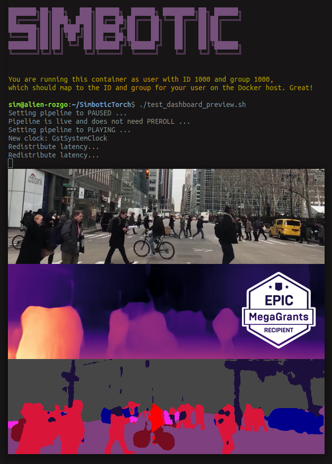
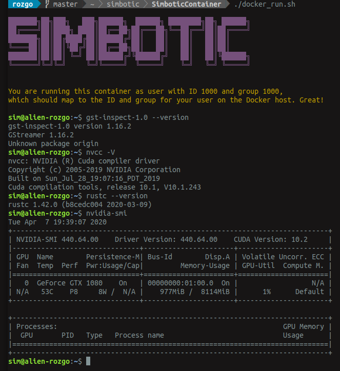
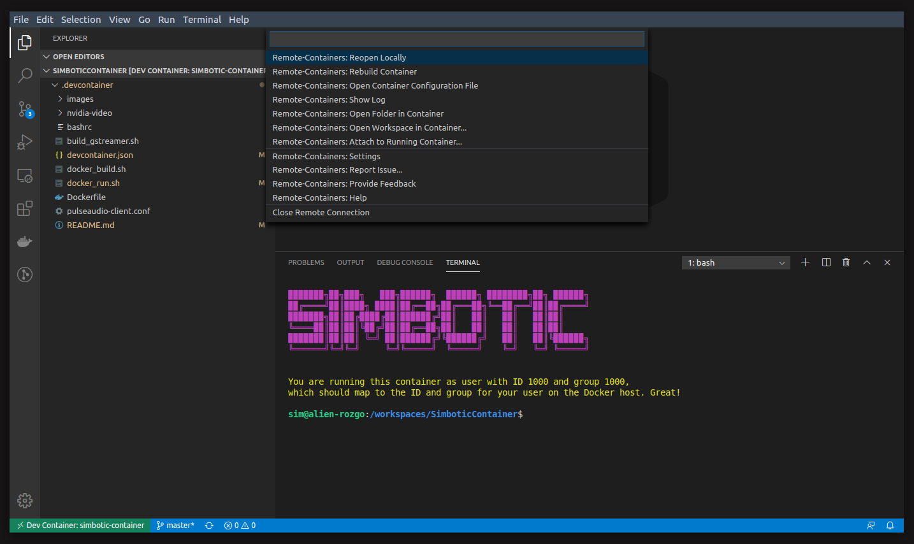

# Simbotic Container
Docker (and VSCode DevContainer) for running computer vision and simulation tools.



## Supports
- SimboticEngine (UnrealEngine 4.0) and plugins
- SimboticTorch (LibTorch GPU)

## Features
- Stable Rust 1.46.0
- GStreamer 1.16.2 (with WebRTC and Data Channels)
- LibTorch 1.6.0 - GPU
- CUDA 10.1
- cuDNN 7.6.5
- nvidia/cudagl:10.1-devel-ubuntu18.04
- Inherits UID/GID from host user
- ssh keys added to container agent
- VSCode Remote Containers



## Pre-requisites

### Audio setup
On host, create pulseaudio socket:

```
pactl load-module module-native-protocol-unix socket=/tmp/pulseaudio.socket
```

### NVidia setup

Setup NVidia docker:
https://github.com/NVIDIA/nvidia-docker

## Setup Docker container
```
./docker_build.sh
./docker_run.sh
```

## Or Setup for VSCode Remote Containers

Move to the root directory of your project and run:
```
git submodule add git@github.com:Simbotic/SimboticContainer.git .devcontainer
```

VSCode:
- Install the VSCode extension [Remote - Containers](https://marketplace.visualstudio.com/items?itemName=ms-vscode-remote.remote-containers)
- Press <kbd>F1</kbd> to bring up the Command Palette and type in *remote-containers* for a full list of commands
- Run the `Remote-Containers: Reopen in Container` command or run `Remote-Containers: Open Folder in Container...` command and select the local folder

**Note:** If you don't want this as a Git Submodule, you may also choose to download this repository as a **zip**, extract its content, and paste it in a `.devcontainer` directory at the root of your project.



## Test using SimboticTorch
https://github.com/Simbotic/SimboticTorch
